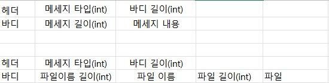

자바 소켓 프로그래밍

1. 프로토콜, 프로토콜 설계
- 프로토콜 : 컴퓨터와 같은 원거리 통신 장비와의 메세지를 주고 받을 경우 사용되는 양식과 규칙을 의미함
- 프로토콜 설계의 이유 : 프로토콜이 존재 하지 않는다면 데이터의 유무만 확인할 수 있을 뿐 해당 데이터에 대한 정보를 얻을 수 없음
- 프로토콜 설계 : 메세지 패킷에 대한 구성요소 정의, byte배열로 통신(byte로 넘긴다면 다른곳에서도 가공할 수 있지 않을까)

2. tcp와 내 패킷에 대한 구조
- 자바의 Socket 클래스를 통해 데이터 송수신을 하게 됨 
- 기본적인 패킷에 대한 구조

 

- 패킷을 받았을 때 해당 내용의 길이를 알려주어 어디까지가 파일 이름 혹은 파일의 내용에 대한 바이트인지 알 수 있게 구성함


3. 코드, 관련 개념
- 현재까지 구성된 패킷의 종류는 헤더 패킷과 그것을 상속하는 여러 메세지 타입의 패킷들이 존재함(기본 메세지, 연결, 연결 중단, 파일 전송)
- 전체 패킷에서 공통적으로 쓰이는 부분은 헤더패킷에 구현 후 나머지 부분들은 각 패킷들이 상속받아 필요한 기능들만 구현
  * 템플릿 메서드 패턴 : 변하지 않는 기능(템플릿)들은 상위 클래스에 만들어주고 자주 변경되거나 하위 클래스에서의 확장될 부분은 따로 구현하는 방식


```java
    public byte[] intToBytes(int i) {
        byte[] b = new byte[4];
        b[0] = (byte) ((i & 0xFF000000) >> 24);
        b[1] = (byte) ((i & 0x00FF0000) >> 16);
        b[2] = (byte) ((i & 0x0000FF00) >> 8);
        b[3] = (byte) (i & 0x000000FF);
        return b;
    }
```


```java
    public static int bytesToInt(byte[] b, int start, int end) {
        int result;
        result = ((b[start] & 0xFF) << 24) |
          ((b[start + 1] & 0xFF) << 16) |
          ((b[start + 2] & 0xFF) << 8) |
          (b[start + 3] & 0xFF);
        return result;
}
```
- 직렬화, 역직렬화
- 빅 엔디안 방식으로 나타냄 -> 단위가 큰 바이트부터 저장
- 해당 부분에서 c언어로 코딩한 서버와 통신하기위해 리틀엔디안 추가시켰음 > c언어는 플랫폼 방식을 따라감, 자바는 가상머신으로 인해 빅엔디안 고정
- 리틀엔디안과 빅엔디안의 속도 차이 -> 사람과 동일함 아래자리 부터 계산하는게 더 빠름


